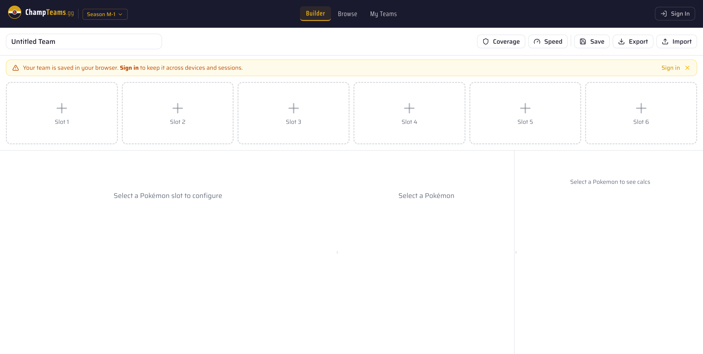
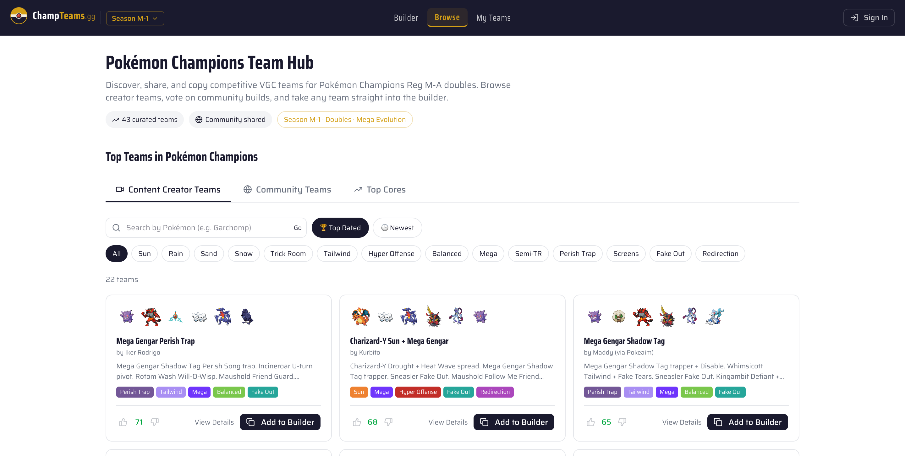
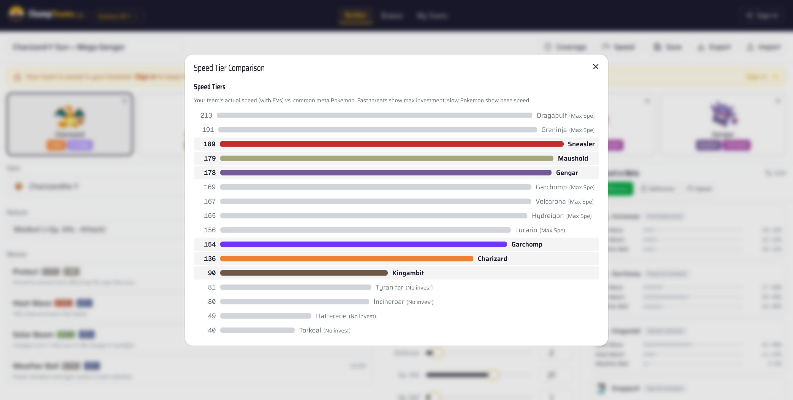
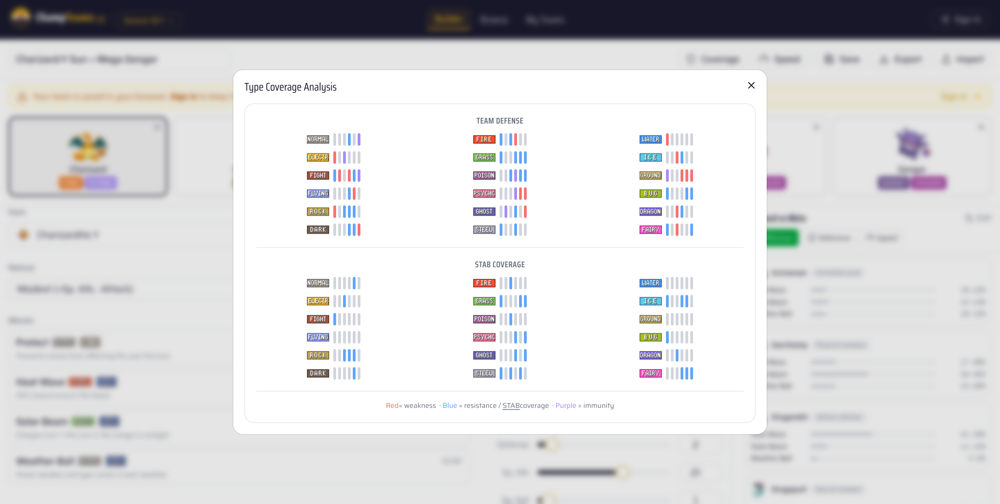

# ChampTeams

> Pokemon Champions team builder. **1,500+ registered users.**

🌐 **Live:** [champteams.gg](https://champteams.gg)

ChampTeams is a competitive team-builder for the Pokemon Champions community — Pokemon roster, damage math, type coverage, and speed tiers all in one place. Built as a side project and grown organically through the Pokemon Champions Reddit community.



## Features

- **Team builder** — full Champions roster with EV/IV/nature/move/item editing
- **Damage calculator** — Smogon-grade math via `@smogon/calc`, side-by-side offensive and defensive calcs
- **Speed tier analysis** — see at a glance who outspeeds whom with current EV spreads
- **Type coverage matrix** — find offensive holes and defensive weaknesses across the team
- **Browse teams** — share builds, discover popular cores from the community
- **Mega and item-aware stats** — preview transformations and Choice/Life Orb effects in calcs

## Screenshots

| Browse teams | Speed tiers | Type coverage |
|---|---|---|
|  |  |  |

## Tech stack

| Layer | Stack |
|---|---|
| Framework | Next.js 16, React 19, TypeScript |
| Styling | Tailwind 4, Radix UI, shadcn/ui |
| Database | PostgreSQL, Drizzle ORM |
| Game data | `@pkmn/data`, `@pkmn/dex`, `@smogon/calc` |
| AI | Anthropic SDK (team-suggestion features) |
| Auth | bcryptjs |
| Deployment | Docker, Next standalone build |

## Run locally

Requires Docker and Node 20+.

```bash
git clone https://github.com/llhtoby38/champteams.gg.git
cd champteams.gg

cp .env.example .env  # fill in DB url + API keys

# Bring up Postgres + seed game data
docker compose up -d --build
docker compose --profile setup run --rm seed

# Dev server
npm install
npm run dev
```

App is then on `http://localhost:3000`.

### Useful scripts

- `npm run db:studio` — Drizzle Studio for the local DB
- `npm run db:push` — apply schema changes
- `npm run seed` — re-seed all Pokemon data (moves, abilities, items, learnsets, type chart, natures)
- `npm run docker:up` / `npm run docker:down` — full Dockerised dev environment

## About

Built and operated solo by [Toby Lee](https://github.com/llhtoby38). Started as a personal tool, opened up to the Pokemon Champions community, grown to 1,500+ registered users with no paid acquisition — purely Reddit word-of-mouth.

## Licence

[MIT](LICENSE)
